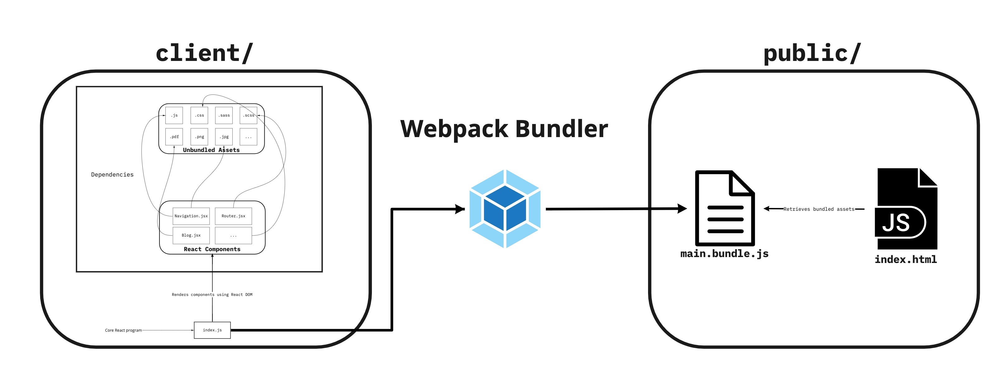

# Website Creation Overview

*Last Updated: 2022-01-28*

---
## Table of Contents

### [Developer Setup](#developer-setup)
Setting up the developer environment and tools needed to develop

#### [Version Control](#version-control)
Using version control for the project

#### [Developer Tools](#developer-tools)
Useful developer tools for creating the project

### [Infrastructure](#infrastructure)
Setting up and deploying the required infrastructure to create the application

#### [Hosting](#hosting)
Hosting the application using AWS LightSail

#### [Storage](#storage)
Storing data for the application using MongoDB and AWS S3

### [Code Set-Up](#code-set-up)
Creating the skeleton code structure for the application and using the MEAN stack framework

#### [Project Skeleton](#project-skeleton)
Creating the outline of the project

#### [Using MEAN as a framework](#using-mean-as-a-framework)
Storing data for the application using MongoDB and AWS S3

### [Front-End](#front-end)
A brief overview of the front-end code configuration

#### [Webpack](#webpack)
Using Webpack to create static assets from front-end code

#### [React](#react)
Using React to create components

### [Back-End](#back-end)
A brief overview of the back-end code configuration

#### [Express](#express)
Creating the application server in Express

#### [Node](#node)
Serving the application using Node

---

## Introduction

### What is this?

This document provides a (rough) step-by-step walk-through of how I've created the website, from using version 
control, to deploying infrastructure, to creating the source code itself.

### Why?

Through the projects I've worked on, I've realized that in each one:

1. I learn a tremendous amount in the process
2. I often use these learnings in other projects
3. I often forget some of my learnings, and
4. Documenting this helps me to capture these learnings for myself and to share with others

So, to those reading this, feel free to glean whatever you may from this document! Creating this has been a passion 
of mine, and I'm excited to share it with you.

### Useful Links
While I've tried to be as verbose as possible throughout this overview, this document is by no means an exhaustive 
explanation of the technology behind this application. If you're not familiar with web application concepts such as:
- **VPS**: Virtual Private Servers; such as AWS LightSail, used to hold instances to serve web applications
- **MERN/MEAN**: Full-stack web application frameworks that include a data layer, front-end, back-end, and run-time 
  environment
- **React**: A front-end framework for web applications
- **Express**: A server framework for web applications
- **Node**: A JavaScript run-time

Some parts of this overview may be confusing/requiring further context. Please see the following links to 
familiarize yourself with these concepts if desired:

- My **[setup](setup)** and **[architecture](../architecture)** docs provide a much more in-depth overview of the
  technical configuration of this application
- **[MERN](https://www.mongodb.com/mern-stack) / [MEAN](https://www.mongodb.com/mean-stack) stacks**: The core
  framework used to develop this application
- **[AWS LightSail](https://aws.amazon.com/lightsail/)**: The pre-configured instance used to hold this application
- **[AWS S3](https://aws.amazon.com/s3/)**: The cloud object storage platform used for asset storage for this
  application
- **[MongoDB](https://www.mongodb.com/)**: The database engine used to run the application
- **[React](https://reactjs.org/)**: The front-end web application framework used in this stack
- **[Express](https://expressjs.com/)**: The back-end web application server framework used in this application
- **[Node](https://nodejs.org/)**: The JavaScript run-time environment that this application is deployed on
- **[Webpack](https://webpack.js.org/)**: The module bundler used to generate static assets from React code

## Developer Setup

### Version Control

As with any good project, I wanted to make use of version control, and went with the de facto tool of choice, Git.

Likely common knowledge, but I initialized a bare repository with a `.gitignore`, i.e.:
  ```shell
  $ git init myWebsite
  $ touch .gitignore
  ```
Making sure that the `.gitignore` would exclude key files and directories from version control from the outset of 
the project, such as `node_modules/`, `.env` files, etc.

#### Generally-Followed Practices

When using Git on any project, I tend to adhere to my own "set" of best practices, including:
- Branching for feature development
- Committing changes frequently
- Creating incremental branches and changes

Although I admittedly don't follow these perfectly, I've noticed that they do streamline my development when I'm 
cognisant about them.

### Developer Tools

In no particular order, the following are some tools I utilize in my development that aided greatly throughout this 
website creation process:
- **IDE (Integrated Development Environment)**
  - For my IDE, I use [IntelliJ IDEA](https://www.jetbrains.com/idea/). I find this tool to be extremely helpful and 
    loaded with plugins.
- **Database GUI**
  - Because this project uses a database, I like to use [MongoDB Compass](https://www.mongodb.com/products/compass) 
    to connect and interface with the MongoDB instance for developer purposes.
- **Miscellaneous**
  - [Postman](https://www.postman.com/) for working with API requests; immensely helpful for debugging API calls
  - [Miro](https://miro.com/) and [Lucid Chart](https://www.lucidchart.com/pages/) for diagramming


## Infrastructure

### Hosting

I followed the [AWS LightSail MEAN Stack](https://www.youtube.com/watch?v=iohBEVf4uIQ) tutorial from Mike Coleman 
for instructions on creating the AWS LightSail instances the hosts this application. After following the tutorial, I 
was able to create:
1. A Linux LightSail instance with a pre-configured MEAN stack
   - If you're not familiar with [MEAN](https://www.mongodb.com/mean-stack), it's essentially a common framework for 
     creating web applications using:
     - **`M`ongo**: [MongoDB](https://www.mongodb.com/); for the database layer
     - **`E`xpress**: [ExpressJS](https://expressjs.com/); for the web application server framework
     - **`A`ngular**: ([ReactJS](https://reactjs.org/) in my case); for the web application front-end framework
     - **`N`ode**: [NodeJS](https://nodejs.org/); for the JavaScript runtime environment
   - MEAN/MERN stacks are great, because they allow you to use full-stack Javascript applications, abstracting some 
     complexities of client-server interactions
2. An open HTTP server on said instance to serve up my application

LightSail provides you with a default key pair (`default.pem`) when you create an instance that you can use to SSH into 
the 
instance 
for development purposes, i.e.:
```shell
$ ssh bitnami@{instance-ip-address} -i default.pem
```

### Storage

#### Database

The pre-configured LightSail instance that I created contains a MongoDB instance. Bitnami provides default 
credentials to connect to this instance, but I also created:
1. A user with a pre-defined role in the instance that the web application could use to connect to the database
   - Mongo provides several [roles](https://docs.mongodb.com/manual/reference/built-in-roles/) for this, but I opted 
     for privileges that would allow the DB client to read/write to any database (i.e. `readWriteAnyDatabase`)
   - I also created a user role for developer purposes with super admin privileges
2. A database in the DB instance to store website data tables (or, collections as MongoDB refers to them as)

i.e.
```shell
$ mongo -u {root-bitnami-username} -p {root-bitnami-password} # This will connect using the default DB admin role
> admin.createUser({ user: '${website-client-username}', password: '${website-client-password}', roles: [ 'readWriteAnyDatabase' ] })
```

Using the created roles, I can connect to MongoDB programmatically or through tools like MongoDB compass using a URI 
connection string, i.e.:
```
mongodb://{user}:{password}@{lightsail-host}:{database-port}/{database-name}?{options}
```
- Note: the default MongoDB port is set to `27017`. There are CLI tools such as `mongod` that you can use on the 
  instance to configure the database instance as well.

#### S3

I also wanted to host files on a secure platform for the website, so opted for AWS S3.

I use S3 Buckets to store "objects", such as images, which my application can then retrieve using the AWS SDK (more 
about this further down).

## Code Set-Up

With the proper developer tools in place, version control for holding source assets, and infrastructure deployed to 
run the application, I was finally ready for the fun part: writing the code.

### Project Skeleton

After creating a repository and deploying infrastructure, I had the following:
1. A bare repository to hold source code
2. Some credentials needed to use infrastructure:
   - Of note, I had:
     - An AWS access key/secret access key pair
       - These can be retrieved under the AWS console > Security & Credentials/Account Settings & IAM > Access Keys.
       - When stored as environment variables, the Node AWS SDK can use these to authenticate to AWS, so I stored them 
         as their environment variable names: `AWS_ACCESS_KEY_ID` and `AWS_SECRET_ACCESS_KEY`.
     - A username and password associated with privileges to my MongoDB instance
       - I used this to create a MongoDB connection string, and stored that as an environment variable as well (`MONGODB_URI`)
     - A keyfile (`default.pem`) for SSH access into my instance
   - As with any "best practice" for security, I try to keep these in a secure location for when they need to be 
     retrieved.

In setting up the skeleton of the project, I made the following structure:

```
.gitignore   # gitignore file
.env         # environment variables
server/      # server source code
client/      # client source code
public/      # public HTMl code/assets
bin/         # executables
```

I then initialized the project as an NPM project:
```shell
$ npm init
```

Which also created a `package.json` at the root directory, used to hold scripts and dependencies for the project.

### Using MEAN as a Framework

The skeleton described above implements a MEAN stack as follows:

- `server/` holds the source code for the Express server
  - This is a back-end layer that allows me to:
    1. Create API calls from the front-end
    2. Serve the front-end web content (more on this further)
- `client/` holds the source code for the client-side React application
  - The React app is the pre-bundled JavaScript that is rendered to create the public HTML for the site (more on 
    this further).
- `public/` holds the bundled HTML of the website that is served over the server
- `bin/` provides an executable that can be run to serve the application on the LightSail instance.

## Front-End

### Webpack

As described earlier, the front-end component of the application is created in React, which can be thought of as 
pre-rendered HTML code that is then generated and bundled into HTML. For a brief overview of what this looks like:



To bundle the React application and its assets dynamic assets with dependencies (i.e. JavaScript modules, 
pre-processed `sass` and `scss` stylesheets, files, etc.), I used Webpack, which allows creates a core JavaScript 
bundle that is then used on the application. This allows me to create a single file, `public/index.html`, that can 
be served over the server as the React application is rendered at build-time.

`public/index.html`:
```html
<!DOCTYPE html>
<html lang="en">
    <body>
        <script src="bundle.js"></script>
    </body>
</html>
```
Where `bundle.js` is the bundled React application.

I first installed the Webpack CLI and some helpful dependencies:
```shell
$ npm i webpack webpack-cli webpack-merge
```

To configure Webpack, I created a Webpack configuration file, `webpack.config.js`, that looks like:
```javascript
module.exports = {
  mode: '', // production or development, depending on the environment
  entry: '', // path to the React application
  output: {...}, // generated output bundle configuration
  resolve: {}, // javascript module resolvers (i.e. resolving .js/.jsx extensions)
  module: {
    rules: [] // rules for loading modules (i.e. loading JS files, importing SASS/SCSS/CSS, importing images)
  },
  plugins: [], // webpack plugins to use
  performance: {} // performance configuration
};
```

The Webpack configuration itself is explained further in the [Setup](setup) docs.

To get the bundler working, I added the following scripts in `package.json`:
```json
{
  ...,
  "scripts": {
    ...,
    "build": "webpack",
    "build:dev": "webpack --mode development",
    "watch": "webpack -w"
  }
}
```

All three scripts invoke the bundler using the Webpack CLI, with `watch` watching for file changes (this can be used 
when running the project in development).

### React

To create the core application served from `client/index.js`, the setup is relatively straightforward.

In `client/index.js`:
```javascript
import React from 'react';
import ReactDOM from 'react-dom';

import Application from './components/Application';

ReactDOM.render(<Application />, document.getElementById('${application-anchor-tag}'));
```

When Webpack invokes this module, it will render the application code on HTML page. On `public/index.html`, I 
specify an anchor tag in the HTML body to render the page at. I also specify some other render configurations, such 
as how to render the document header, but this is all described in the [setup](setup) docs.

## Back-End

### Express

The back-end component for the application is an Express server. The core server module in `server/index.js` looks like:
```javascript
const express = require('express');
const server = express();

// Server middleware functions, i.e.:
server.use('/api', router); // Use the router module for '/api' requests
server.use(loggingMiddleware) // Add logging middleware

// Send the bundled HTML output
server.use(express.static(path.resolve(__dirname, '../dist'))); // Send static assets
server.get('*', (_, res) => res.sendFile(path.resolve(__dirname, '../dist/index.html'))); // Send bundled HTML

module.exports = {
  server
};
```

Middleware functions are executed sequentially, so the order of operations is important. I first attach various 
middlewares, then set up API routing, and finally direct the server to send my bundled React application in this 
file. Again, this is covered in further depth in the [setup](setup) docs.

### Node

Node runs the Express server using an executable in `bin/www`:
```javascript
#!/usr/bin/env node

const http = require('http');
const { server } = require('../server');

const httpServer = http.createServer(server);
const port = server.get('port');

httpServer.listen(port);
httpServer.on('error', onErrorHandler);
httpServer.on('listening', onListeningHandler);
```

The entire application can then be launched via Node:
```shell
$ node bin/www
```

This thread establishes the HTTP server on the local host of its environment, so if I run it from my machine, I can 
access it from `127.0.0.1:port`, or when deployed on the instance, it will run the server on the instance's static 
IP, thus running the program.

## Conclusion

I hope the *rough* attempt above provided an overview of how this application was created. To summarize in a very 
quick overview, I:

1. Set up my development environment and tools, including creating a git project to hold this repository
2. Deployed infrastructure to serve the application, including an AWS LightSail instance with a pre-configured MEAN 
   stack that creates the build and runtime environments for it, as well as a MongoDB instance and AWS S3 buckets 
   for data storage
3. Created a project skeleton, with:
   - A client that provides the React application
   - A bundler that bundles that application into static assets via Webpack
   - A server using Express that can serve the static bundled assets
   - An executable that can run the entire program using Node

Although this overview was relatively concise and straightforward, that does **not** reflect the development process 
itself. As with any project, there were many points of learning, failure, refactors, redbulls, and stackoverflow 
deep dives along the way; but that is what makes this process so enjoyable, and I'm glad I could capture a 
perspective into the process here. This document and project is subject to evolve over time, but my core takeaways 
stay the same:

1. Have fun.
2. Development is an iterative process; don't be afraid to tweak things, change course, or revert. It is in the 
   process of doing all of this that you and your projects become better.
3. Write some kick-ass code

Thanks for reading, and I hope to see you over at [jens-johnson.com](https://www.jens-johnson.com)! 💻🌎