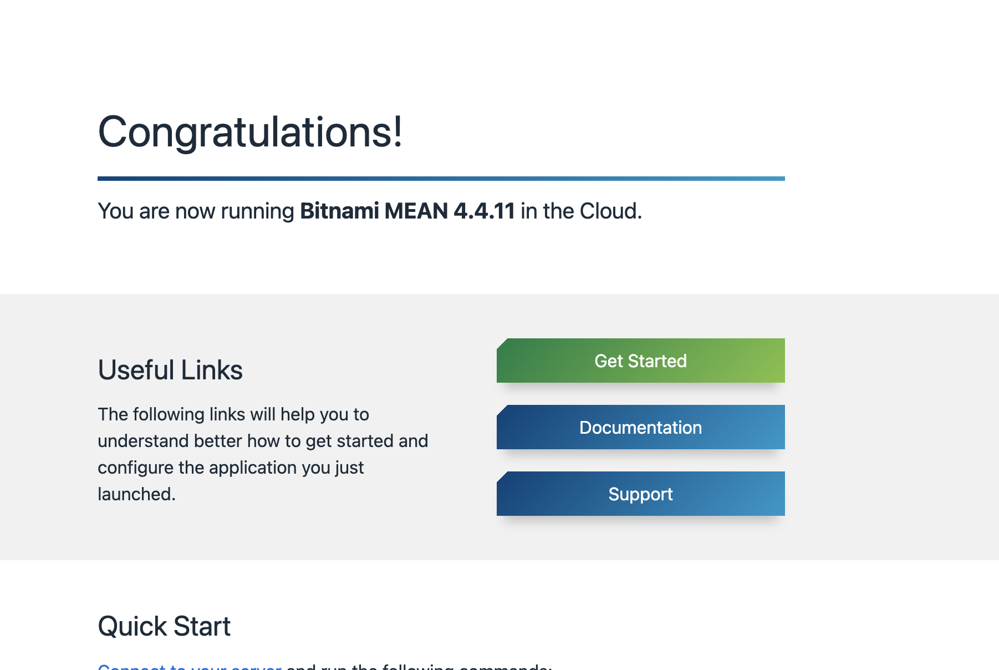

# Infrastructure Overview

*Last Updated: 2022-01-28*

## Introduction

This document provides a brief overview of the infrastructure used to create this project.

## Hosting

I'm using [AWS Lightsail](https://aws.amazon.com/lightsail/) to host the site. Lightsail provides a pre-configured
`MEAN` stack running on a Bitnami Linux instance. This pre-configuration allowed me to quickly deploy the 
application while focusing on the app itself.

### Configuration

The instance provided through Lightsail comes with a pre-configured `bitnami` user. The core application code lives 
under this user on the instance, i.e. in `/home/bitnami/applications/jens-johnson.com`.

### Apache Server

#### Configuration

The instance image comes with an Apache server running on the default HTTP 80 port and HTTPS 443 port. This means that 
accessing the instance's IP from a browser will return the default Apache page  at `/opt/bitnami/apache2/htdocs/index.html` on the 
image, i.e. something like:


In order to serve the web application from the Apache server, I had to add virtual hosts that listen on these ports 
and provide a pass-through to the application content being served on its own HTTP server (i.e. on port 3000):

`/opt/bitnami/apache2/conf/vhosts/jens-johnson-http-vhost.conf`:
```
<VirtualHost _default_:80>
  ServerAlias *
  DocumentRoot "/home/bitnami/applications/jens-johnson.com/"
  <Directory "/home/bitnami/applications/jens-johnson.com/">
    Require all granted
  </Directory>
  ProxyPass / http://localhost:3000/
  ProxyPassReverse / http://localhost:3000/
</VirtualHost>
```

`/opt/bitnami/apache2/conf/vhosts/jens-johnson-https-vhost.conf`:
```
<VirtualHost _default_:443>
  ServerAlias *
  SSLEngine on
  SSLCertificateFile "/opt/bitnami/apache/conf/bitnami/certs/server.crt"
  SSLCertificateKeyFile "/opt/bitnami/apache/conf/bitnami/certs/server.key"
  DocumentRoot "/home/bitnami/applications/jens-johnson.com/"
  <Directory "/honme/bitnami/applications/jens-johnson.com/">
    Require all granted
  </Directory>
  ProxyPass / http://localhost:3000/
  ProxyPassReverse / http://localhost:3000/
</VirtualHost>
```

I then restarted the `apache` service to launch the changes (because these are configuration files, the changes are
also permanent at startup):

```shell
$ sudo /opt/bitnami/ctlscript.sh restart apache
```

#### HTTPS Configuration

The Apache server can be configured to support HTTPS with LetsEncrpyt. I did this using Bitnami's configuration wizard:

```shell
$ sudo /opt/bitnami/bncert-tool
```

#### Deployment

With the application created and bundled in `/home/bitnami/applications/jens-johnson.com`, it can be run using a 
runner script that I've created in `/home/bitnami/config/bin/jens-johnson.com/start.sh`.

Running
```shell
$ /home/bitnami/config/bin/jens-johnson.com/start.sh
```

Will invoke this script, which launches the application using the `forever` module, spawning a node process to keep 
it running indefinitely. Under the hood, this looks something like

```shell
forever ./launch-config.json
```

Which launches the application using some pre-configured `forever` options that I have set.

## Domain Service

I wanted a custom domain for the site instead of the default IP that came with the Lightsail instance used to host 
the site (obviously it wouldn't be ideal to tell people to visit `192.472.40.21` or something when they visited my 
site). Thankfully, [jens-johnson.com](http://jens-johnson.com) was available through Google Domains. Once the 
instance was configured, and I had the server running on the default HTTP port, I was able to use DNS routing to 
configure my custom domain to point to my site (more on this in the [Lightsail](../../../architecture/hosting/lightsail.md)
architecture docs).

## Storage

- The website uses the MongoDB instance on the Lightsail stack for storage.
- The application itself uses a client that connects to the DB through a privileged role, i.e.:
  
- The access role/connection URI is authenticated through a simple username/password combination specified in the connection string, i.e.:
  ```
  mongodb://{user}:{password}@{host}:{port}/{website-database-name}?authSource=admin&readPreference=primary&directConnection=true
  ```
- I've also created roles that allow me to connect to the website database through services like MongoDB compass for debugging and development.